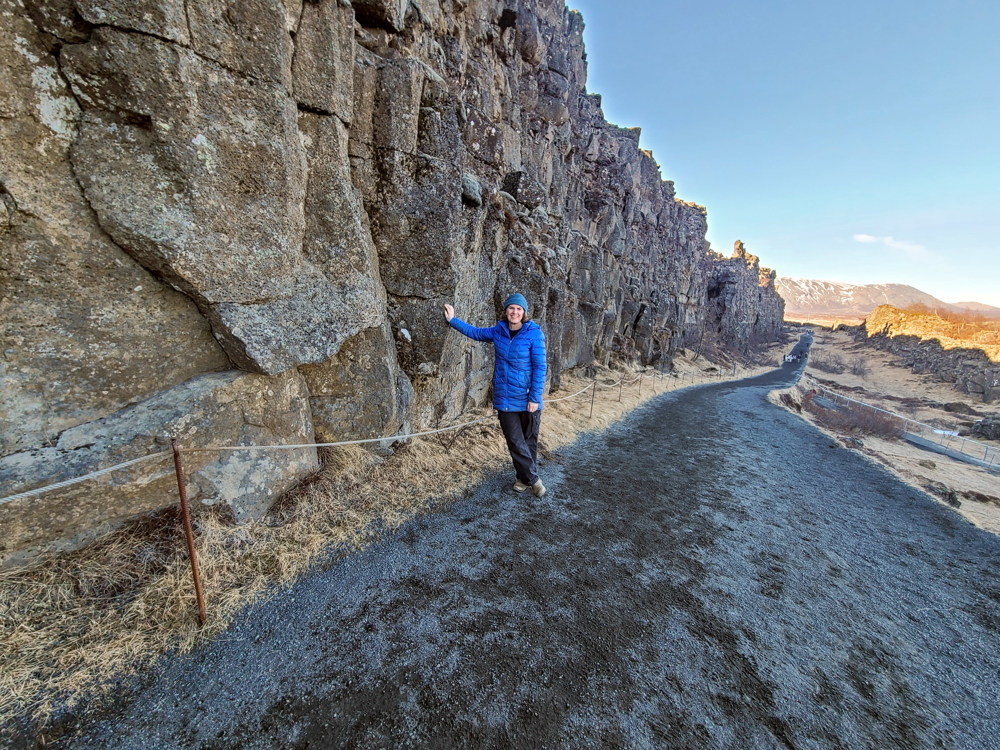

# mlgeo2024_jenwils
Jen Wilson's repo for MLGEO 2024 Fall 2024

## Installation 

1. Clone the repo into a new directory mlgeo_jenwils
    ```
    git clone https://github.com/UW-MLGEO/mlgeo2024_jenwils.git
    ```
2. Set up your environment
   
    Change to the new directory
    ```
    cd mlgeo2024_jenwils
    ```
    Setup your environment from the YAML file
    ```
    conda env create -f environment.yml -n mlgeo
    ```
    Activate your new environment
    ```
    conda activate mlgeo
    ```

The best earth science topics according to me:

- Iceland. Yes, the entire country.
<figure>
    
    <figcaption><small>Holding up North America at Thingvellir National Park (April 2024)</small></figcaption>
</figure>

- Volcanic hazards

- Water resources management

## Licensing
This open-source project is licensed under the [MIT license](https://opensource.org/license/MIT).